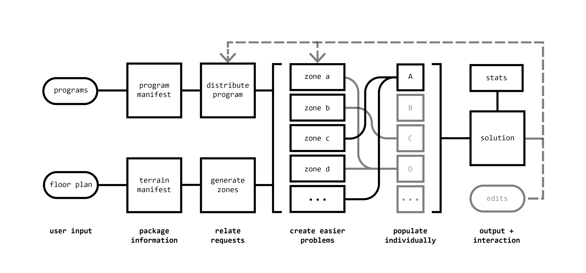

# Burolandschafter

The Burolandschafter is an engine for automated office space planning. Ultimately, the goal is to create an interface for the *interactive* and (user-definable) *optimal* generation of office layouts as potentially complicated as [examples of its namesake](https://en.wikipedia.org/wiki/Office_landscape). The code currently available is limited to a proof-of-concept phase in Summer 2018.

A paper on version `1.1.0` will be published in the proceedings for the 107th annual ACSA conference [Black Box](http://www.acsa-arch.org/programs-events/conferences/annual-meeting/107th-annual-meeting). A link will be provided when available.

## Usage

The github release includes the necessary grasshopper assembly, pre-made definition, and related example rhino file. Detailed instructions for creating custom scenarios, descriptions for each component/input, and other examples will be available at a future date.

## Outline

The `1.1.0` code as-released was developed by one student with minimal existing knowledge of C# syntax and standards. As a result, the code's logical flow and structure is not great. In the near future, it's more likely that existing (better) development will be released than it is that this code will be arbitrarily refactored for clarity. Please refer to the paper for (some) direction. Or, feel free to open an issue with any questions.

## Examples

